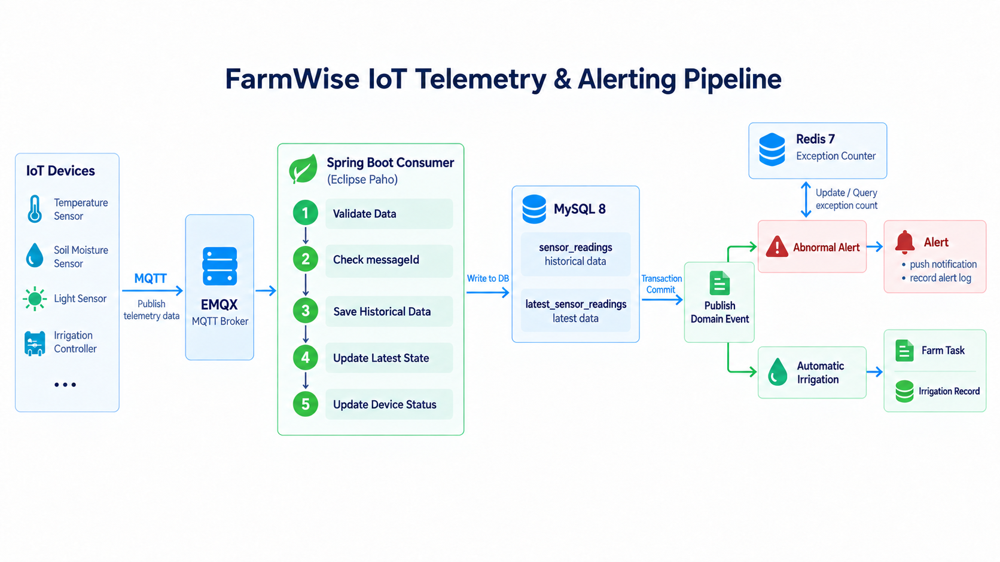
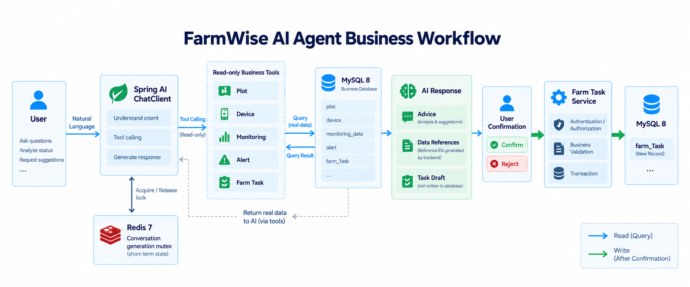
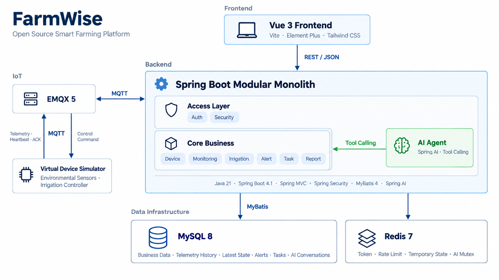

# FarmWise

FarmWise 是一个面向智慧农业场景的 IoT 管理与智能决策平台。系统采用 Vue 3 + Spring Boot 构建，提供地块与种植计划管理、设备接入、环境监测、智能灌溉、异常预警、农事任务、报告生成和 AI 技术顾问等功能，并通过 MQTT 连接虚拟传感器与灌溉控制器。

## 核心业务链路

### IoT 遥测与预警

虚拟设备通过 MQTT 向 EMQX 上报遥测数据，后端使用 Eclipse Paho 消费消息，并完成数据校验、业务幂等、历史数据写入和最新状态更新。主事务提交后，再触发预警判定和自动灌溉等后续业务。



图中展示了设备上报、消息校验、messageId 幂等、历史数据与最新状态投影，以及事务提交后的预警和自动灌溉处理。

### AI Agent 业务闭环

AI 技术顾问基于 Spring AI `ChatClient` 和 Tool Calling 实现。模型不会直接读取数据库，也不能直接修改业务数据，而是通过后端提供的业务工具按需查询地块、设备、监测、预警和任务信息。



AI 只通过只读工具查询真实业务数据，生成建议和任务草稿；确认后的写操作仍由后端业务服务完成。

## 系统架构



后端当前采用模块化单体架构。认证、设备、监测、灌溉、预警、任务、AI 和报告等模块保持独立的业务职责，同时共享本地事务和统一数据模型。

当前规模下没有引入微服务、服务注册中心、额外的内部消息队列或分布式事务。设备数据、预警和任务之间存在较强事务关系，模块化单体能够在控制复杂度的同时保留清晰的模块边界。

## 功能

| 模块        | 主要能力                                                |
| ----------- | ------------------------------------------------------- |
| 认证与权限  | 注册、验证码、登录、JWT、刷新令牌、退出、用户资料、RBAC |
| 地块管理    | 地块 CRUD、种植计划及状态管理                           |
| 设备管理    | 设备 CRUD、设备状态、虚拟传感器、灌溉控制器             |
| 环境监测    | 实时状态、历史趋势、环境阈值、设备在线状态              |
| 智能灌溉    | 手动控制、自动配置、MQTT 指令、设备回执、执行记录       |
| 异常预警    | 连续异常判定、恢复判断、预警处理、任务联动              |
| 农事任务    | 人工任务、预警任务、种植计划任务、AI 建议任务           |
| AI 技术顾问 | Tool Calling、真实业务数据查询、引用、任务草稿          |
| 报告中心    | 生成时的数据快照和 AI 建议快照，只读保存                |

## 技术栈

| 层次           | 技术                                        |
| -------------- | ------------------------------------------- |
| Frontend       | Vue 3、Vite、Element Plus、Tailwind CSS     |
| Backend        | Java 21、Spring Boot 4.1、Spring MVC        |
| Data Access    | MyBatis 4、MySQL 8、Flyway                  |
| Security       | Spring Security、JWT、RBAC                  |
| Cache / State  | Redis 7                                     |
| IoT            | EMQX 5、MQTT、Eclipse Paho                  |
| AI             | Spring AI、OpenAI Compatible API            |
| Infrastructure | Docker Compose、Nginx、Actuator、Micrometer |

## 快速开始

### Docker Compose

环境要求：

- Docker
- Docker Compose
- 可访问的 MySQL 8 实例

复制环境变量配置：

```bash
cp .env.example .env
```

填写数据库、JWT、邮件、AI 和 MQTT 等配置后启动：

```bash
docker compose up -d
```

默认服务地址：

| Service        | Address                |
| -------------- | ---------------------- |
| Frontend       | http://127.0.0.1:8081  |
| Backend        | http://127.0.0.1:8080  |
| EMQX Dashboard | http://127.0.0.1:18083 |

当前 `compose.yml` 使用预构建镜像标签；如果本地不存在对应镜像，需要先完成镜像构建或加载。

MySQL 使用外部实例，当前 Compose 不负责 HTTPS 和域名证书配置。

## 项目结构

```text
FarmWise/
├── frontend/
├── backend/
│   └── src/main/java/com/farmwise/
│       ├── auth/
│       ├── security/
│       ├── device/
│       ├── monitoring/
│       ├── irrigation/
│       ├── alert/
│       ├── task/
│       ├── ai/
│       └── report/
├── simulator/
├── docs/
├── compose.yml
├── run-backend-local.sh
└── run-simulator-local.sh
```

## License

MIT License.
